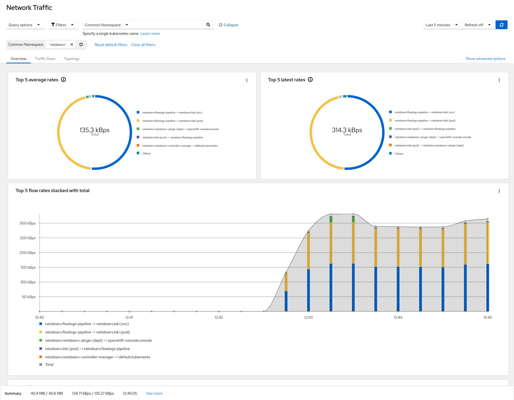
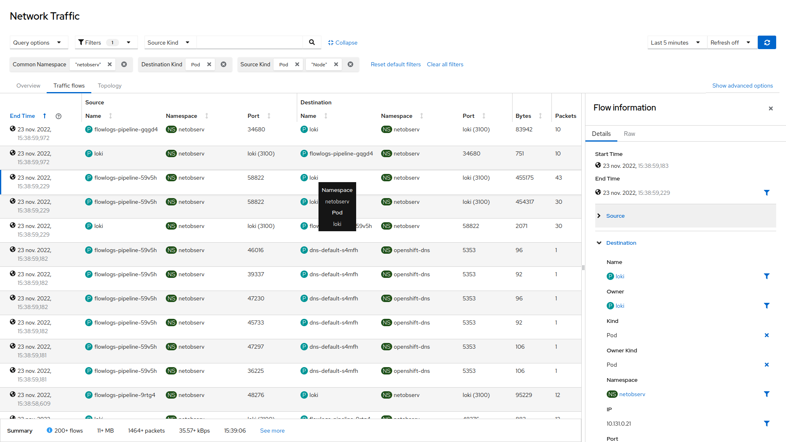
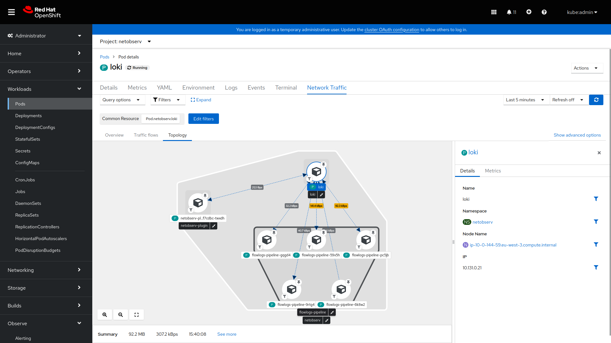

# NetObserv Operator


[](https://goreportcard.com/report/github.com/netobserv/network-observability-operator)

NetObserv Operator is a Kubernetes / OpenShift operator for network observability. It deploys a monitoring pipeline to collect and enrich network flows. These flows can be produced by the NetObserv eBPF agent, or by any device or CNI able to export flows in IPFIX format, such as OVN-Kubernetes.

The operator provides dashboards, metrics, and keeps flows accessible in a queryable log store, Grafana Loki. When used in OpenShift, new views are available in the Console.

## Getting Started

You can install NetObserv Operator using [OLM](https://olm.operatorframework.io/) if it is available in your cluster, or directly from its repository.

### Install with OLM

NetObserv Operator is available in [OperatorHub](https://operatorhub.io/operator/netobserv-operator) with guided steps on how to install this. It is also available in the OperatorHub catalog directly in the OpenShift Console.


Please read the [operator description in OLM](./config/descriptions/upstream.md). You will need to install Loki, some instructions are provided there.

After the operator is installed, create a `FlowCollector` resource:


Refer to the [Configuration section](#configuration) of this document.

### Install from repository

A couple of `make` targets are provided in this repository to allow installing without OLM:

```bash
git clone https://github.com/netobserv/network-observability-operator.git && cd network-observability-operator
USER=netobserv make deploy deploy-loki deploy-grafana
```

It will deploy the operator in its latest version, with port-forwarded Loki and Grafana.

> Note: the `loki-deploy` script is provided as a quick install path and is not suitable for production. It deploys a single pod, configures a 10GB storage PVC, with 24 hours of retention. For a scalable deployment, please refer to [our distributed Loki guide](https://github.com/netobserv/documents/blob/main/loki_distributed.md) or [Grafana's official documentation](https://grafana.com/docs/loki/latest/).

To deploy the monitoring pipeline, this `make` target installs a `FlowCollector` with default values:

```bash
make deploy-sample-cr
```

Alternatively, you can [grab and edit](./config/samples/flows_v1beta2_flowcollector.yaml) this config before installing it.

You can still edit the `FlowCollector` after it's installed: the operator will take care about reconciling everything with the updated configuration:

```bash
kubectl edit flowcollector cluster
```

Refer to the [Configuration section](#configuration) of this document.

#### Install older versions

To deploy a specific version of the operator, you need to switch to the related git branch, then add a `VERSION` env to the above make command, e.g:

```bash
git checkout 1.0.4
USER=netobserv VERSION=1.0.4 make deploy deploy-loki deploy-grafana
make deploy-sample-cr
```

Beware that the version of the underlying components, such as flowlogs-pipeline, may be tied to the version of the operator (this is why we recommend switching the git branch). Breaking this correlation may result in crashes. The versions of the underlying components are defined in the `FlowCollector` resource as image tags.

### OpenShift Console

_Pre-requisite: OpenShift 4.10 or above_

If the OpenShift Console is detected in the cluster, a console plugin is deployed when a `FlowCollector` is installed. It adds new pages and tabs to the console:

#### Overview metrics

Charts on this page show overall, aggregated metrics on the cluster network. The stats can be refined with comprehensive filtering and display options. Different levels of aggregations are available: per zone, per node, per namespace, per owner or per pod/service. For instance, it allows to identify biggest talkers in different contexts: top X inter-namespace flows, or top X pod-to-pod flows within a namespace, etc.

The watched time interval can be adjusted, as well as the refresh frequency, hence you can get an almost live view on the cluster traffic. This also applies to the other pages described below.



#### Topology

The topology view represents traffic between elements as a graph. The same filtering and aggregation options as described above are available, plus extra display options e.g. to group element by node, namespaces, etc. A side panel provides contextual information and metrics related to the selected element.


_This screenshot shows the NetObserv architecture itself: Nodes (via eBPF agents) sending traffic (flows) to the collector flowlogs-pipeline, which in turn sends data to Loki. The NetObserv console plugin fetches these flows from Loki._

#### Flow table

The table view shows raw flows, ie. non aggregated, still with the same filtering options, and configurable columns.



#### Integration with existing console views

These views are accessible directly from the main menu, and also as contextual tabs for any Pod, Deployment, Service (etc.) in their details page, with filters set to focus on that particular resource.




### Grafana

Grafana can be used to retrieve and show the collected flows from Loki. If you used the `make` commands provided above to install NetObserv from the repository, you should already have Grafana installed and configured with Loki data source. Otherwise, you can install Grafana by following the instructions [here](https://github.com/netobserv/documents/blob/main/hack_loki.md#grafana), and add a new Loki data source that matches your setup. If you used the provided quick install path for Loki, its access URL is `http://loki:3100`.

To get dashboards, import [this file](./config/samples/dashboards/Network%20Observability.json) into Grafana. It includes a table of the flows and some graphs showing the volumetry per source or destination namespaces or workload:


## Configuration

The `FlowCollector` resource is used to configure the operator and its managed components. A comprehensive documentation is [available here](./docs/FlowCollector.md), and a full sample file [there](./config/samples/flows_v1beta2_flowcollector.yaml).

To edit configuration in cluster, run:

```bash
kubectl edit flowcollector cluster
```

As it operates cluster-wide, only a single `FlowCollector` is allowed, and it has to be named `cluster`.

A couple of settings deserve special attention:

- Agent (`spec.agent.type`) can be `eBPF` (default) or `IPFIX`. eBPF is recommended, as it should work in more situations and offers better performances. If you can't, or don't want to use eBPF, note that the IPFIX option is fully functional only when using [OVN-Kubernetes](https://github.com/ovn-org/ovn-kubernetes/) CNI. Other CNIs are not officially supported, but you may still be able to configure them manually if they allow IPFIX exports.

- Agent features (`spec.agent.ebpf.features`) can enable more features such as tracking packet drops, TCP latency (RTT) and DNS requests and responses.

- Sampling (`spec.agent.ebpf.sampling` and `spec.agent.ipfix.sampling`): a value of `100` means: one flow every 100 is sampled. `1` means all flows are sampled. The lower it is, the more flows you get, and the more accurate are derived metrics, but the higher amount of resources are consumed. By default, sampling is set to 50 (ie. 1:50) for eBPF and 400 (1:400) for IPFIX. Note that more sampled flows also means more storage needed. We recommend to start with default values and refine empirically, to figure out which setting your cluster can manage.

- Loki (`spec.loki`): configure here how to reach Loki. The default URL values match the Loki quick install paths mentioned in the _Getting Started_ section, but you may have to configure differently if you used another installation method. You will find more information in our guides for deploying Loki: [with Loki Operator](https://github.com/netobserv/documents/blob/main/loki_operator.md), or an alternative ["distributed Loki" guide](https://github.com/netobserv/documents/blob/main/loki_distributed.md). You should set `spec.loki.mode` according to the chosen installation method, for instance use `LokiStack` if you use the Loki Operator.

- Quick filters (`spec.consolePlugin.quickFilters`): configure preset filters to be displayed in the Console plugin. They offer a way to quickly switch from filters to others, such as showing / hiding pods network, or infrastructure network, or application network, etc. They can be tuned to reflect the different workloads running on your cluster. For a list of available filters, [check this page](./docs/QuickFilters.md).

- Kafka (`spec.deploymentModel: Kafka` and `spec.kafka`): when enabled, integrates the flow collection pipeline with Kafka, by splitting ingestion from transformation (kube enrichment, derived metrics, ...). Kafka can provide better scalability, resiliency and high availability. It's also an option to consider when you have a bursty traffic. [This page](https://www.redhat.com/en/topics/integration/what-is-apache-kafka) provides some guidance on why to use Kafka. When configured to use Kafka, NetObserv operator assumes it is already deployed and a topic is created. For convenience, we provide a quick deployment using [Strimzi](https://strimzi.io/): run `make deploy-kafka` from the repository.

- Exporters (`spec.exporters`) an optional list of exporters to which to send enriched flows. Currently, KAFKA and IPFIX are available (only KAFKA being actively maintained). This allows you to define any custom storage or processing that can read from Kafka or from an IPFIX collector.

- To enable availability zones awareness, set `spec.processor.addZone` to `true`.

### Performance fine-tuning

In addition to sampling and using Kafka or not, other settings can help you get an optimal setup without compromising on the observability.

Here is what you should pay attention to:

- Resource requirements and limits (`spec.agent.ebpf.resources`, `spec.agent.processor.resources`): adapt the resource requirements and limits to the load and memory usage you expect on your cluster. The default limits (800MB) should be sufficient for most medium sized clusters. You can read more about reqs and limits [here](https://kubernetes.io/docs/concepts/configuration/manage-resources-containers/).

- eBPF agent's cache max flows (`spec.agent.ebpf.cacheMaxFlows`) and timeout (`spec.agent.ebpf.cacheActiveTimeout`) control how often flows are reported by the agents. The higher are `cacheMaxFlows` and `cacheActiveTimeout`, the less traffic will be generated by the agents themselves, which also ties with less CPU load. But on the flip side, it leads to a slightly higher memory consumption, and might generate more latency in the flow collection.

- It is possible to reduce the overall observed traffic by restricting or excluding interfaces via `spec.agent.ebpf.interfaces` and `spec.agent.ebpf.excludeInterfaces`. Note that the interface names may vary according to the CNI used.

- Each component offers more advanced settings via `spec.agent.ebpf.advanced`, `spec.processor.advanced`, `spec.loki.advanced` and `spec.consolePlugin.advanced`. The agent has [environment variables](https://github.com/netobserv/netobserv-ebpf-agent/blob/main/docs/config.md) that you can set through `spec.agent.ebpf.advanced.env`.

#### Loki

The `FlowCollector` resource includes configuration of the Loki client, which is used by the processor (`flowlogs-pipeline`) to connect and send data to Loki for storage. They impact two things: batches and retries.

- `spec.loki.writeBatchWait` and `spec.loki.writeBatchSize` control the batching mechanism, ie. how often data is flushed out to Loki. Like in the eBPF agent batching, higher values will generate fewer traffic and consume less CPU, however it will increase a bit the memory consumption of `flowlogs-pipeline`, and may increase a bit collection latency.

- `spec.loki.advanced.writeMinBackoff`, `spec.loki.writeMaxBackoff` and `spec.loki.writeMaxRetries` control the retry mechanism. Retries may happen when Loki is unreachable or when it returns errors. Often, it is due to the rate limits configured on Loki server. When such situation occurs, it might not always be the best solution to increase rate limits (on server configuration side) or to increase retries. Increasing rate limits will put more pressure on Loki, so expect more memory and CPU usage, and also more traffic. Increasing retries will put more pressure on `flowlogs-pipeline`, as it will retain data for longer and accumulate more flows to send. When all the retry attempts fail, flows are simply dropped. Flow drops are counted in the metric `netobserv_loki_dropped_entries_total`.

On the Loki server side, configuration differs depending on how Loki was installed, e.g. via Helm chart, Loki Operator, etc. Nevertheless, here are a couple of settings that may impact the flow processing pipeline:

- Rate limits ([cf Loki documentation](https://grafana.com/docs/loki/latest/configuration/#limits_config)), especially ingestion rate limit, ingestion burst size, per-stream rate limit and burst size. When these rate limits are reached, Loki returns an error when `flowlogs-pipeline` tries to send batches, visible in logs. A good practice is to define an alert, to get notified when these limits are reached: [cf this example](https://github.com/netobserv/documents/blob/main/examples/distributed-loki/alerting/loki-ratelimit-alert.yaml). It uses a metrics provided by the Loki operator: `loki_request_duration_seconds_count`. In case you don't use the Loki operator, you can replace it by the same metric provided by NetObserv Loki client, named `netobserv_loki_request_duration_seconds_count`.

- Max active streams / max streams per user: this limit is reached when too many streams are created. In Loki terminology, a stream is a given set of labels (keys and values) used for indexing. NetObserv defines labels for source and destination namespaces and pod owners (ie. aggregated workloads, such as Deployments). So the more workloads are running and generating traffic on the cluster, the more chances there are to hit this limit, when it's set. We recommend setting a high limit or turning it off (0 stands for unlimited).

#### With Kafka

More performance fine-tuning is possible when using Kafka, ie. with `spec.deploymentModel` set to `Kafka`:

- You can set the size of the batches (in bytes) sent by the eBPF agent to Kafka, with `spec.agent.ebpf.kafkaBatchSize`. It has a similar impact than `cacheMaxFlows` mentioned above, with higher values generating less traffic and less CPU usage, but more memory consumption and more latency. It is recommended to keep these two settings somewhat aligned (ie. do not set a super low `cacheMaxFlows` with high `kafkaBatchSize`, or the other way around). We expect the default values to be a good fit for most environments.

- If you find that the Kafka consumer might be a bottleneck, you can increase the number of replicas with `spec.processor.kafkaConsumerReplicas`, or set up an horizontal autoscaler with `spec.processor.kafkaConsumerAutoscaler`.

- Other advanced settings for Kafka include `spec.processor.kafkaConsumerQueueCapacity`, that defines the capacity of the internal message queue used in the Kafka consumer client, and `spec.processor.kafkaConsumerBatchSize`, which indicates to the broker the maximum batch size, in bytes, that the consumer will read.


### Securing data and communications

#### Authorizations

NetObserv is meant to be used by cluster admins, or, when using the Loki Operator (v5.7 or above), project admins (ie. users having admin permissions on some namespaces only). Multi-tenancy is based on namespaces permissions, with allowed users able to get flows limited to their namespaces. Flows across two namespaces will be visible to them as long as they have access to at least one of these namespaces.

Since `FlowCollector v1beta2`, NetObserv is automatically configured with multi-tenancy enabled when `spec.loki.mode` is `LokiStack`.

To give flow logs access to a `test` user, run:

```bash
oc adm policy add-cluster-role-to-user netobserv-reader test
```

More information about multi-tenancy can be found on [this page](https://github.com/netobserv/documents/blob/main/loki_operator.md#netobserv-configuration).

Note that multi-tenancy is not possible without using the Loki Operator.

#### Network Policy

For a production deployment, it is also highly recommended to lock down the `netobserv` namespace (or wherever NetObserv is installed) using network policies.
An example of network policy is [provided here](https://github.com/netobserv/documents/blob/main/examples/lockdown-netobserv.yaml).

#### Communications

By default, communications between internal components are not secured. Note that, when using the Loki Operator, securing communication with TLS is necessary. There are several places where TLS can be set up:

- Connections to Loki (from the processor `flowlogs-pipeline` and from the Console plugin), by setting `spec.loki.tls`.
- With Kafka (both on producer and consumer sides), by setting `spec.kafka.tls`. Mutual TLS is supported here.
- The metrics server running in the processor (`flowlogs-pipeline`) can listen using TLS, via `spec.processor.metrics.server.tls`.
- The Console plugin server always uses TLS.

## Development & building from sources

Please refer to [this documentation](./DEVELOPMENT.md) for everything related to building, deploying or bundling from sources.

## F.A.Q / Troubleshooting

Please refer to [F.A.Q / Troubleshooting main document](./FAQ.md).

## Contributions

This project is licensed under [Apache 2.0](./LICENSE) and accepts contributions via GitHub pull requests. Other related `netobserv` projects follow the same rules:
- [Flowlogs-pipeline](https://github.com/netobserv/flowlogs-pipeline)
- [eBPF agent](https://github.com/netobserv/netobserv-ebpf-agent)
- [OpenShift Console plugin](https://github.com/netobserv/network-observability-console-plugin)

External contributions are welcome and can take various forms:

- Providing feedback, by starting [discussions](https://github.com/netobserv/network-observability-operator/discussions) or opening [issues](https://github.com/netobserv/network-observability-operator/issues).
- Code / doc contributions. You will [find here](./DEVELOPMENT.md) some help on how to build, run and test your code changes. Don't hesitate to [ask for help](https://github.com/netobserv/network-observability-operator/discussions/categories/q-a).
